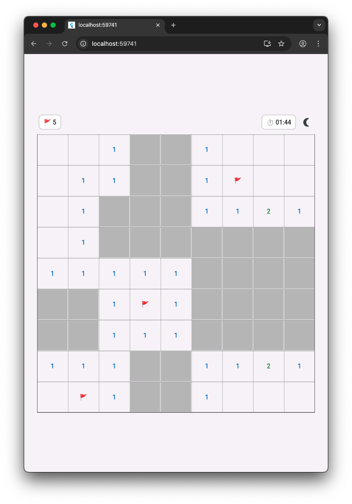
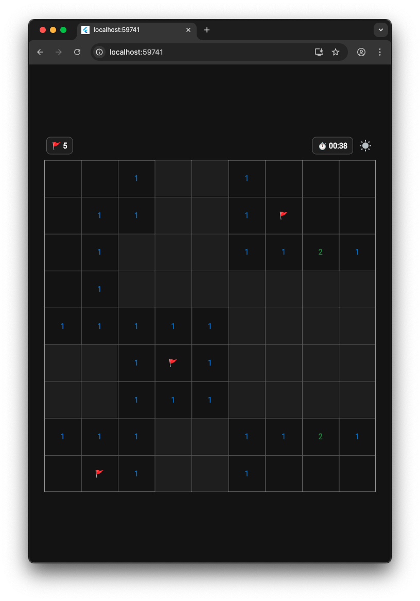
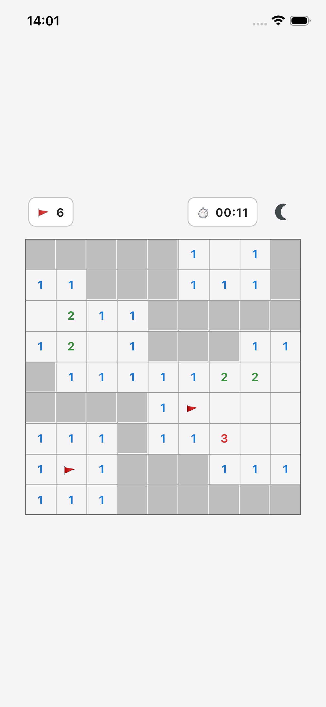
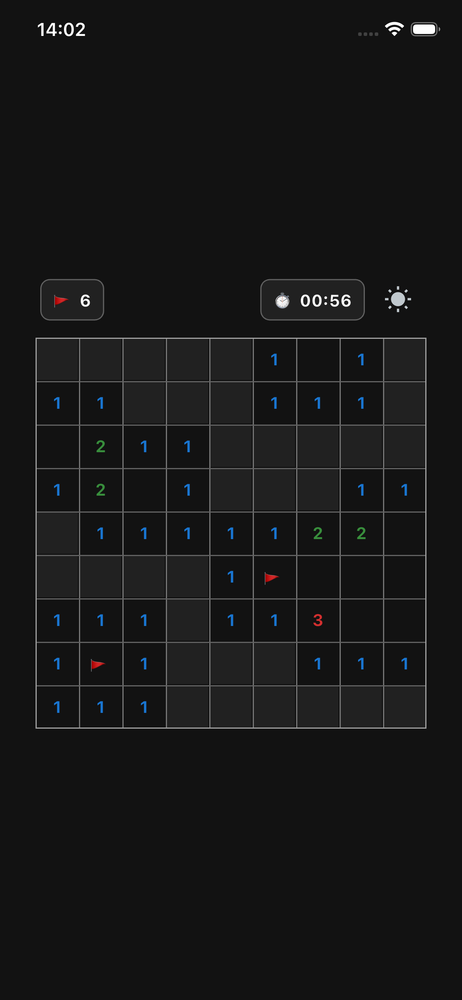

<div align="center">

# Minesweeper

Classic Minesweeper built with Flutter — fast, responsive, and themed for light and dark modes.

[](LICENSE)


</div>

## Overview

Clear the board by revealing all safe cells without triggering any mines. Built with a clean architecture: a testable engine, a declarative UI, and centralized theming.

### Key features

- Classic rules with flood‑fill reveal for zero tiles
- Chord action: click a revealed number to auto‑reveal neighbors when flags match the number
- First‑click safety: your first reveal is guaranteed safe
- Flagging: long‑press (mobile) or right‑click / Shift+click (desktop & web)
- Difficulty selector: Easy, Medium, Hard
- Theme switcher: light and dark themes with tuned colors and contrasts
- Hover highlights and refined grid/border styling
- Timer and remaining flag counter
- Web: browser context menu disabled for proper right‑click flagging

## Table of contents

- Screenshots
- How to play
- Controls
- Quick start
- Project structure
- Development
- Troubleshooting
- License

## Screenshots

<table>
  <tr>
    <td align="center">
      
      <div><sub>Desktop — Light theme</sub></div>
    </td>
    <td align="center">
      
      <div><sub>Desktop — Dark theme</sub></div>
    </td>
  </tr>
  <tr>
    <td align="center">
      
      <div><sub>Mobile — Light theme</sub></div>
    </td>
    <td align="center">
      
      <div><sub>Mobile — Dark theme</sub></div>
    </td>
  </tr>
</table>

## How to play

1. Reveal a cell to see if it is safe.
2. Numbers show how many mines are adjacent.
3. Flag cells you suspect contain mines.
4. Use the chord action on revealed numbers when you’ve flagged the required neighbors.
5. Win by revealing all non‑mine cells.

## Controls

- Mobile: tap to reveal; long‑press to toggle a flag
- Desktop/Web: left‑click to reveal; right‑click or Shift+click to toggle a flag

Notes for web: the app disables the browser’s context menu so right‑click can be used for flags.

## Quick start

Prerequisites: Flutter SDK installed and on your PATH.

```bash
# Get dependencies
flutter pub get

# Run on your preferred device (examples)
flutter run -d chrome           # Web
flutter run -d macos            # macOS desktop
flutter run -d ios              # iOS simulator or device
flutter run -d android          # Android emulator or device
flutter run -d windows          # Windows desktop
flutter run -d linux            # Linux desktop
```

If you have multiple devices, run `flutter devices` to list them.

## Project structure

The app separates core logic from UI and theming for clarity and reuse:

- `lib/engine/minesweeper_engine.dart` — Core game rules and state: board generation, flood‑fill reveal, flags, chord action, first‑click safety, win/loss transitions.
- `lib/models/coords.dart` — Simple coordinate model shared across layers.
- `lib/ui/` — UI layer:
  - `ui/board/game_grid.dart` — Interactive grid surface (hover, gestures, rendering layers for numbers, flags, mines, overlays).
  - `ui/widgets/game_header.dart` — Difficulty selector (pre‑game) and flags/timer header (in‑game), theme toggle.
  - `ui/widgets/status_overlay.dart` — Themed Win/Loss overlay with reset.
  - `ui/layout/game_board_builder.dart`, `ui/layout/position.dart` — Layout helpers for grid coordinate placement.
  - `ui/theme/minesweeper_theme.dart` — Centralized color system for numbers, zero fill, grid/borders, overlays; includes theme mode control.
- `lib/web_context_menu/` — Web‑only shim to disable the browser context menu.
- `lib/main.dart` — App entry: wires Material themes and boots the `GameScreen`.

## Development

Recommended commands:

```bash
# Static analysis
flutter analyze

# Format code
dart format .

# Run app (see Quick start for device targets)
flutter run -d chrome
```

### Platform notes

- iOS/macOS: Ensure CocoaPods is installed (`sudo gem install cocoapods`) and run from Xcode at least once if codesigning is needed.
- Android: Use an emulator or a connected device with developer mode enabled.
- Web: Right‑click is used for flags; the native context menu is disabled intentionally.
- Desktop: Enable desktop support if needed (`flutter config --enable-macos-desktop`, etc.).

## Troubleshooting

- “Right‑click opens the browser menu” on web — Hard refresh after a hot‑restart, or ensure you’re running the Flutter web build (not a static HTML preview).
- iOS build issues (Pods) — Run `pod repo update` inside `ios/` or open the workspace in Xcode to resolve signing.
- Device not found — Run `flutter doctor -v` and `flutter devices` to verify your setup.

## License

This project is licensed under the MIT License — see [LICENSE](LICENSE) for details.
